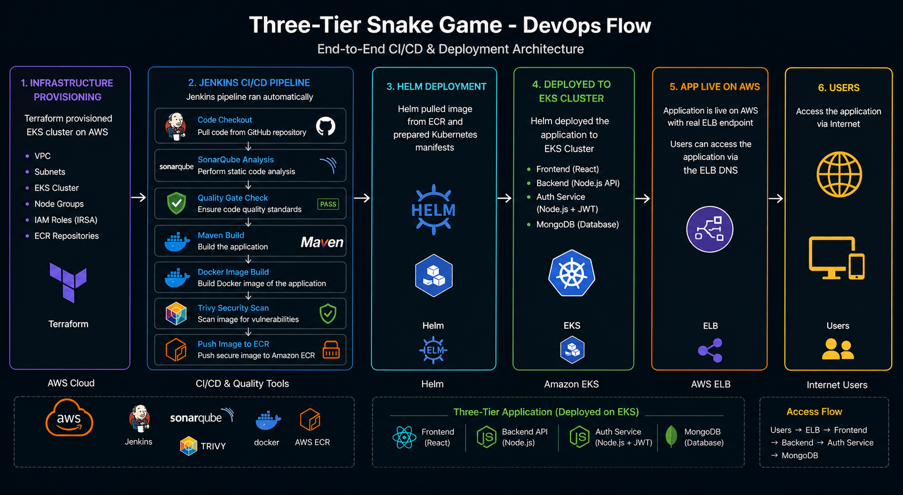

# 🐍 Three-Tier Snake Game

A fully functional Snake Game built as a production-ready **four-tier microservices application** with JWT authentication, a complete DevSecOps CI/CD pipeline, containerized with Docker, and deployed on AWS EKS using Terraform and Helm.



## 📐 Architecture

```
                        ┌──────────────────────────────────────────────────┐
                        │              AWS EKS Cluster                     │
                        │              Namespace: three-tier-dev           │
                        │                                                  │
                        │   ┌─────────────────────────┐                    │
  Browser               │   │      Ingress (Nginx)    │                    │
  ──────────────────────┼──►│                         │                    │
                        │   └────────────┬────────────┘                    │
                        │                │                                 │
                        │   /       /api        /auth                      │
                        │   ▼         ▼            ▼                       │
                        │  frontend  backend    auth-svc                   │
                        │  :80       :5000       :4000                     │
                        │  (Nginx)   (Node.js)  (Node.js)                  │
                        │                │            │                    │
                        │           mongodb-svc (Headless)                 │
                        │                │                                 │
                        │           MongoDB (StatefulSet)                  │
                        │                │                                 │
                        │            PVC gp2 (100Mi)                       │
                        └──────────────────────────────────────────────────┘
```


## 🔄 CI/CD Pipeline

Three independent Jenkins pipelines — one for each custom image. Images are pushed to AWS ECR.

```
GitHub Push (branch selectable)
         │
         ▼
Clean Workspace → Clone Repo → SonarQube Analysis → Quality Gate
         │
         ▼
Build Docker Image → Trivy Scan (report + gate) → Push to ECR
```

| Stage | What it does |
|-------|-------------|
| Clean workspace | Wipes Jenkins workspace |
| Clone repo | Pulls selected branch from GitHub |
| SonarQube analysis | Scans source code for bugs and vulnerabilities |
| Quality gate | Waits for SonarQube result — marks unstable if failed |
| Build Docker image | Builds image from Dockerfile |
| Trivy scan | Generates HTML report then gates on HIGH/CRITICAL CVEs |
| Push to ECR | Authenticates via IAM role and pushes to AWS ECR |
| Post actions | Archives Trivy report, prunes old images, cleans workspace |

### Jenkins setup requirements

| Requirement | Details |
|------------|---------|
| IAM Role on Jenkins EC2 | `AmazonEC2ContainerRegistryFullAccess`, `AmazonEKSClusterPolicy`, `AmazonEKSWorkerNodePolicy` |
| Jenkins credential | `sonarqube` — SonarQube token as Secret text |
| SonarQube server | Name: `sonar-server`, URL: `http://SONARQUBE_IP:9000` |
| SonarQube scanner tool | Name: `sonar-scanner` |
| SonarQube webhook | `http://JENKINS_IP:8080/sonarqube-webhook/` |


## 🎮 What the App Does

- Snake game on a 20×20 grid controlled with arrow keys
- Register and login with a username and password
- Score increases by 10 points per food eaten
- Score automatically saved to MongoDB with your username when the game ends
- Leaderboard shows top 10 highest scores with player names
- Leaderboard refreshes automatically after every game
- About page with project info, tech stack, and author details
- Session persists on page refresh via sessionStorage


## 🗂️ Project Structure

```
three-tier-snake-game/
│
├── frontend/                           # React + Vite
│   ├── src/
│   │   ├── components/
│   │   │   ├── GameBoard.jsx           # Game grid renderer
│   │   │   ├── GameBoard.module.css
│   │   │   ├── Scoreboard.jsx          # Top 10 leaderboard
│   │   │   └── Scoreboard.module.css
│   │   ├── context/
│   │   │   └── AuthContext.jsx         # JWT auth state (sessionStorage)
│   │   ├── hooks/
│   │   │   └── useGame.js              # All snake game logic
│   │   ├── pages/
│   │   │   ├── Login.jsx
│   │   │   ├── Register.jsx
│   │   │   ├── GamePage.jsx
│   │   │   ├── GamePage.module.css
│   │   │   ├── About.jsx
│   │   │   ├── About.module.css
│   │   │   └── Auth.module.css
│   │   ├── App.jsx                     # Routes and protected routes
│   │   ├── api.js                      # All HTTP calls
│   │   ├── index.css                   # Global styles (Inter + Press Start 2P)
│   │   └── main.jsx
│   ├── nginx.conf                      # Custom Nginx with gzip, caching, security headers
│   ├── .env.development                # Local dev
│   ├── .env.docker                     # Docker Compose
│   ├── .env.production                 # Kubernetes / EKS
│   └── Dockerfile                      # Multi-stage: Node build → Nginx serve
│
├── backend/                            # Node.js + Express API
│   ├── src/
│   │   ├── config/db.js                # MongoDB connection
│   │   ├── middleware/auth.js          # JWT verification middleware
│   │   ├── models/Score.js             # Score schema (score + username + userId)
│   │   ├── routes/scores.js            # POST (auth required) and GET endpoints
│   │   └── server.js                   # Express entry point + /health
│   ├── .env                            # Local dev only
│   ├── .env.docker                     # Docker Compose
│   ├── .trivyignore
│   └── Dockerfile
│
├── auth-service/                       # JWT Auth Microservice
│   ├── src/
│   │   ├── config/db.js
│   │   ├── models/User.js              # User schema (username + bcrypt password)
│   │   ├── routes/auth.js              # /register /login /verify + /health
│   │   └── server.js
│   ├── .env.docker
│   ├── .trivyignore
│   └── Dockerfile
│
├── helm-chart/                         # Helm chart
│   └── three-tier-snake-game/
│       ├── Chart.yaml
│       ├── values.yaml                 # Images from ECR, storageClass gp2
│       └── templates/
│           ├── frontend-dep.yml
│           ├── frontend-svc.yml
│           ├── backend-dep.yml
│           ├── backend-svc.yml
│           ├── backend-configmap.yml
│           ├── auth-dep.yml
│           ├── auth-svc.yml
│           ├── auth-configmap.yml
│           ├── mongodb-dep.yml         # StatefulSet
│           ├── mongo-svc.yml           # Headless service
│           ├── mongo-secret.yml
│           └── ingress.yml
│
├── k8s-manifest/                       # Raw Kubernetes manifests (Kind/local)
│   ├── namespace.yml
│   ├── ingress.yml
│   ├── frontend/
│   ├── backend/
│   ├── auth-service/
│   └── database/
│
├── infrastructure/                     # Terraform — AWS EKS infrastructure
│   ├── main.tf                         # Module calls
│   ├── variables.tf
│   ├── output.tf
│   ├── provider.tf                     # AWS provider
│   ├── terraform.tfvars                # Your values
│   └── modules/
│       ├── vpc/                        # VPC, subnets, IGW, routes
│       ├── eks/                        # EKS cluster, node group, IAM roles, OIDC
│       └── ecr/                        # ECR repositories
│
├── jenkins-pipeline/                   # Jenkinsfiles
│   ├── frontend/Jenkinsfile
│   ├── backend/Jenkinsfile
│   └── auth-service/Jenkinsfile
│
├── docker-compose.yml                  # Local four-container setup
└── z-documentation/
    └── three-tier-snake-game-docs.docx
```


## ⚙️ Tech Stack

| Layer | Technology |
|-------|-----------|
| Frontend | React 18, Vite, React Router, Axios, Nginx |
| Backend | Node.js, Express, Mongoose, JWT, dotenv |
| Auth Service | Node.js, Express, bcryptjs, JWT, Mongoose |
| Database | MongoDB 7.0 |
| CI/CD | Jenkins, SonarQube, Trivy |
| Image Registry | AWS ECR |
| Container | Docker |
| Orchestration | Kubernetes (EKS / Kind) |
| Package Manager | Helm |
| Infrastructure | Terraform |
| Ingress | Nginx Ingress Controller |
| Persistence | EBS PVC via StatefulSet (gp2, 100Mi) |


## ☁️ Infrastructure — Terraform

Terraform provisions the full AWS infrastructure before deploying the app.

### What it creates

| Resource | Details |
|---------|---------|
| VPC | Custom VPC with CIDR `10.1.0.0/16` |
| Subnets | 3 subnets across `ap-south-1a`, `ap-south-1b`, `ap-south-1c` |
| EKS Cluster | Managed Kubernetes cluster |
| Node Group | `m7i-flex.large`, ON_DEMAND, min 1 / desired 1 / max 2, 30GB disk |
| IAM Roles | Cluster role + node group role with required policies |
| OIDC Provider | For IRSA (IAM Roles for Service Accounts) |
| EBS CSI Driver | For PersistentVolumeClaim support on EKS |
| ECR Repositories | `frontend`, `backend`, `auth-service` |

### How to use

```bash
cd infrastructure

# Initialise
terraform init

# Review what will be created
terraform plan

# Create infrastructure (~10-15 minutes)
terraform apply

# Destroy when done (to avoid charges)
terraform destroy
```

### Configure `terraform.tfvars` before applying

```hcl
region            = "ap-south-1"
vpc_name          = "EKS-demo-vpc"
vpc_cidr          = "10.1.0.0/16"
cluster_name      = "eks_cluster"
node_group_name   = "eks-node-group"
instance_type     = ["m7i-flex.large"]
capacity_type     = "ON_DEMAND"
desired_size      = 1
min_size          = 1
max_size          = 2
disk_size         = 30
repositories      = ["frontend", "backend", "auth-service"]
```


## 🚀 Running Locally

### Option 1 — Manual (four terminals)

```bash
# Terminal 1 — MongoDB
sudo systemctl start mongod

# Terminal 2 — Auth service
cd auth-service && npm install && npm run dev   # port 4000

# Terminal 3 — Backend
cd backend && npm install && npm run dev         # port 5000

# Terminal 4 — Frontend
cd frontend && npm install && npm run dev         # port 5173
```

**Environment files needed:**

`auth-service/.env`
```
MONGO_URI=mongodb://localhost:27017/snakegame
JWT_SECRET=your_secret_here
PORT=4000
```

`backend/.env`
```
MONGO_URI=mongodb://localhost:27017/snakegame
JWT_SECRET=your_secret_here
PORT=5000
```

`frontend/.env.development`
```
VITE_API_URL=http://YOUR_IP:5000/api
VITE_AUTH_URL=http://YOUR_IP:4000
```


### Option 2 — Docker Compose

```bash
docker compose up
```

| Service | URL |
|---------|-----|
| Frontend | http://localhost:8080 |
| Backend | http://localhost:5000 |
| Auth Service | http://localhost:4000 |
| MongoDB | localhost:27017 |

> Requires `backend/.env.docker` and `auth-service/.env.docker` to exist.


## ☸️ Kubernetes Deployment

### Option 1 — EKS (Production)

**Prerequisites:** Terraform applied, AWS CLI configured, kubectl installed, Helm installed

```bash
# Connect kubectl to EKS
aws eks update-kubeconfig --name eks_cluster --region ap-south-1

# Install Nginx Ingress Controller
kubectl apply -f https://raw.githubusercontent.com/kubernetes/ingress-nginx/controller-v1.11.1/deploy/static/provider/aws/deploy.yaml

# Deploy with Helm
helm install snake-game ./helm-chart/three-tier-snake-game \
  --namespace three-tier-dev \
  --create-namespace

# Get app URL
kubectl get ingress -n three-tier-dev
```

> Update `ECR_REGISTRY` in all Jenkinsfiles with your AWS account ID before running pipelines.


### Option 2 — Kind (Local)

```bash
# Create cluster
kind create cluster --config k8s-manifest/cluster.yml --name three-tier

# Install Nginx Ingress Controller
kubectl apply -f https://raw.githubusercontent.com/kubernetes/ingress-nginx/main/deploy/static/provider/kind/deploy.yaml

# Apply manifests
kubectl apply -f k8s-manifest/namespace.yml
kubectl apply -f k8s-manifest/database/
kubectl apply -f k8s-manifest/backend/
kubectl apply -f k8s-manifest/auth-service/
kubectl apply -f k8s-manifest/frontend/
kubectl apply -f k8s-manifest/ingress.yml

# Add to /etc/hosts
echo "127.0.0.1 snake-game.com" | sudo tee -a /etc/hosts
```


## 🎯 Helm Reference

```bash
# Install
helm install snake-game ./helm-chart/three-tier-snake-game

# Upgrade with new image tag
helm upgrade snake-game ./helm-chart/three-tier-snake-game \
  --set frontend.tag=1.0.5

# Change storage class (Kind vs EKS)
helm install snake-game ./helm-chart/three-tier-snake-game \
  --set mongodb.storageClassName=gp2    # EKS
  --set mongodb.storageClassName=standard  # Kind

# Rollback
helm rollback snake-game 1

# Uninstall
helm uninstall snake-game
```


## 📡 API Reference

### Backend

| Method | Endpoint | Auth | Description |
|--------|----------|------|-------------|
| GET | `/health` | No | Kubernetes liveness probe |
| POST | `/api/scores` | JWT | Save score after game over |
| GET | `/api/scores` | No | Get top 10 scores |

### Auth Service

| Method | Endpoint | Auth | Description |
|--------|----------|------|-------------|
| GET | `/health` | No | Kubernetes liveness probe |
| POST | `/auth/register` | No | Create account |
| POST | `/auth/login` | No | Login — returns JWT token |
| GET | `/auth/verify` | JWT | Verify token |


## 🔐 How JWT Auth Works

```
Register/Login → Auth Service → MongoDB (users collection)
                             ← JWT token (7 day expiry)

Save Score → Backend (validates JWT using shared JWT_SECRET)
                    → Extracts username from token payload
                    → Saves score + username to MongoDB

Backend never calls Auth Service again after login.
JWT_SECRET must be identical in both services.
```


## 🗄️ Database

- **Database:** `snakegame`
- **Credentials:** Kubernetes Secret (`mongo-sec`)
- **Storage:** EBS gp2 PVC (100Mi) via StatefulSet volumeClaimTemplates

| Collection | Fields |
|-----------|--------|
| `scores` | score, username, userId, createdAt |
| `users` | username, password (bcrypt), createdAt |


## 🔧 Kubernetes Resources

| Resource | Name | Details |
|----------|------|---------|
| Namespace | `three-tier-dev` | Isolates all resources |
| Deployment | `frontend-deployment` | Nginx + React |
| Deployment | `backend-dep` | Node.js API |
| Deployment | `auth-dep` | Auth microservice |
| StatefulSet | `mongodb-deployment` | MongoDB |
| Service | `frontend-svc` | ClusterIP — port 80 |
| Service | `backend-svc` | ClusterIP — port 5000 |
| Service | `auth-svc` | ClusterIP — port 4000 |
| Service | `mongodb-svc` | Headless — port 27017 |
| ConfigMap | `backend-config` | MONGO_URI, PORT |
| ConfigMap | `auth-config` | MONGO_URI, PORT |
| Secret | `mongo-sec` | MongoDB credentials + JWT_SECRET |
| PVC | `mongodb-volume-claim` | Auto-created by StatefulSet |
| Ingress | `ingress` | `/` → frontend, `/api` → backend, `/auth` → auth |


## 🛡️ Security

| Feature | Applied To |
|---------|-----------|
| SonarQube analysis + quality gate | All three pipelines |
| Trivy image scanning HIGH/CRITICAL | All three pipelines |
| bcrypt password hashing (10 rounds) | Auth service |
| JWT token authentication (7d expiry) | Auth + Backend |
| `seccompProfile: RuntimeDefault` | All pods |
| `allowPrivilegeEscalation: false` | All containers |
| `privileged: false` | All containers |
| Credentials via Kubernetes Secret | MongoDB + JWT |
| IAM role on Jenkins EC2 (no hardcoded keys) | Jenkins server |
| `.trivyignore` with documented justifications | Backend, Auth service |


## 📊 Resource Limits

| Tier | Memory Request | Memory Limit | CPU Request | CPU Limit |
|------|---------------|-------------|-------------|-----------|
| Frontend | 100Mi | 100Mi | 100m | 200m |
| Backend | 250Mi | 250Mi | 300m | 500m |
| Auth Service | 250Mi | 250Mi | 300m | 500m |
| MongoDB | 256Mi | 512Mi | 250m | 500m |


## 🔍 Health Checks

| Tier | Type | Path | Readiness | Liveness |
|------|------|------|-----------|---------|
| Frontend | HTTP GET | `/` port 80 | 10s | 15s |
| Backend | HTTP GET | `/health` port 5000 | 10s | 15s |
| Auth Service | HTTP GET | `/health` port 4000 | 10s | 15s |
| MongoDB | exec mongosh ping | — | 30s (5 retries) | 60s |


## 🛑 Useful Commands

```bash
# Check pods
kubectl get pods -n three-tier-dev -o wide

# Stream logs
kubectl logs -f deployment/backend-dep -n three-tier-dev
kubectl logs -f deployment/auth-dep -n three-tier-dev
kubectl logs -f statefulset/mongodb-deployment -n three-tier-dev

# Restart deployment
kubectl rollout restart deployment/auth-dep -n three-tier-dev

# Helm status
helm status snake-game
helm history snake-game

# Delete everything
helm uninstall snake-game
kubectl delete namespace three-tier-dev

# Terraform destroy (save AWS credits)
cd infrastructure && terraform destroy
```


## 🔧 Common Modifications

| What | File | Edit |
|------|------|------|
| Image tags | `helm-chart/.../values.yaml` | `frontend.tag`, `backend.tag`, `auth.tag` |
| Storage class | `helm-chart/.../values.yaml` | `mongodb.storageClassName` |
| Game speed | `frontend/src/hooks/useGame.js` | `const SPEED = 150` |
| Grid size | `frontend/src/hooks/useGame.js` | `const COLS`, `const ROWS` |
| Points per food | `frontend/src/hooks/useGame.js` | `setScore((s) => s + 10)` |
| Top scores count | `backend/src/routes/scores.js` | `.limit(10)` |
| JWT expiry | `auth-service/src/routes/auth.js` | `expiresIn: '7d'` |
| EKS node count | `infrastructure/terraform.tfvars` | `desired_size`, `max_size` |
| EKS instance type | `infrastructure/terraform.tfvars` | `instance_type` |


## 📄 License

MIT
