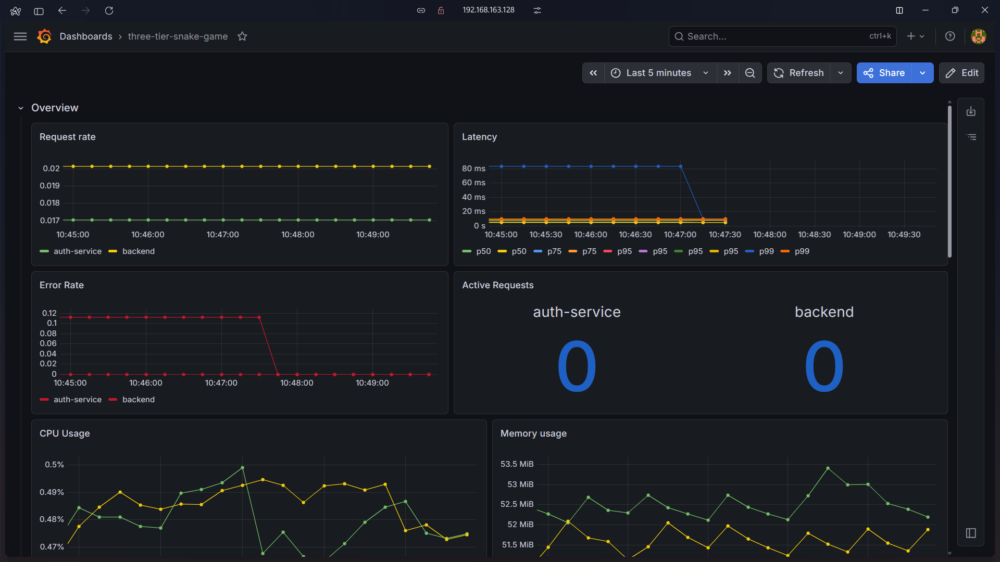
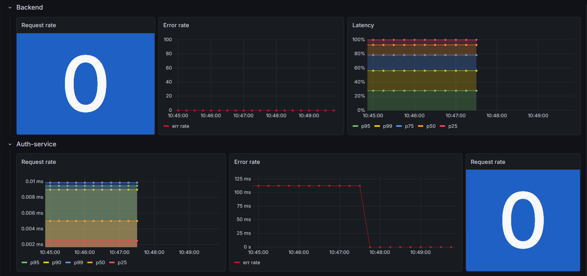
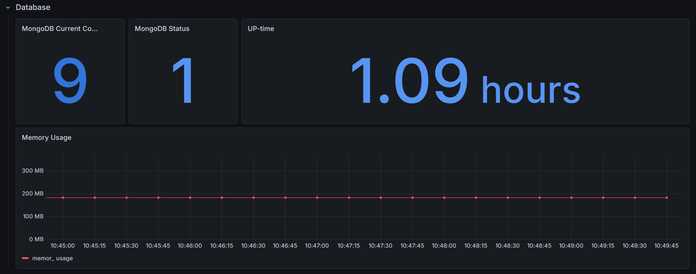

# Monitoring & Observability Stack

This folder contains the complete monitoring and observability setup for the three-tier snake game project. It includes application-level metrics, MongoDB monitoring, Node.js runtime metrics, and Grafana dashboards for visualizing system health, performance, latency, request traffic, and error rates across services.

